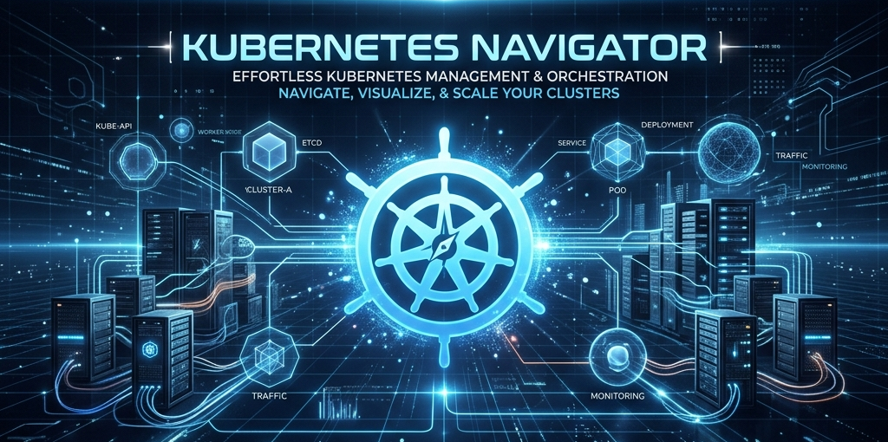

<div align="center">
  
  
<h1 align="center">☸️ Kubernetes Navigator</h1>
  
  
  
  
  
  
  
  
  
  
  **A premium, interactive web portal to learn Kubernetes architecture and master local cluster deployments on Windows 11.**

</div>

---

## 🚀 View Live Site

The project is live and accessible online.

<a href="https://ajaygangwar945.github.io/Kubernetes-Navigator/">
    </a>

---

## 🚀 Key Features

* **Interactive Concept Cards**: Clickable glassmorphism components detailing Pods, Nodes, Deployments, and Services.
* **Prerequisites Tracker**: Custom progress-bar-linked checklist that saves checked states locally to `localStorage`.
* **Timelined Roadmap**: Numbered setup timeline covering `winget` CLI installs for `kubectl` and `minikube`.
* **PowerShell CLI Simulator**: A simulated console inside the browser where clicking buttons animates real typing and outputs mock status, node, and pod results.
* **Master Cheat Sheet**: Detailed, scrollable tabular guide for daily kubectl commands.

---

## 📁 File Structure

```text
Kubernetes-Navigator/
├── .github/
│   └── workflows/
│       └── docker.yaml
├── .dockerignore
├── .gitignore
├── banner.png
├── Dockerfile
├── documentation.txt
├── index.html
└── README.md
```

---

## 💻 Local Run Methods

You can launch and view the interactive guide locally using any of these methods:

### Method 1: Direct File Launch
Simply double-click the `index.html` file to open it in your default web browser (Chrome, Edge, Firefox, etc.).

### Method 2: Python Development Server
To run the project on a local HTTP port (recommended for cookie/localStorage testing):
```bash
python -m http.server 8000
```
Open `http://localhost:8000` in your web browser.

### Method 3: Node.js Development Server
```bash
npx http-server -p 8080
```
Open `http://localhost:8080` in your web browser.

---

## 🛠️ Windows 11 Local K8s Installation

### 1. Enable Virtualization
Check the **Performance** tab in Windows Task Manager to confirm Virtualization is enabled in the BIOS/UEFI.

### 2. Install kubectl
Open **PowerShell** as **Administrator** and run:
```powershell
winget install Kubernetes.kubectl
```

### 3. Install Minikube
Open **PowerShell** as **Administrator** and run:
```powershell
winget install Kubernetes.minikube
```

### 4. Start Local Cluster
```powershell
minikube start --driver=docker
```

---

## 🐳 Host Page in Docker

Host the navigator locally as an Nginx-backed web server:

```bash
# Build the Nginx Alpine container
docker build -t kubernetes-navigator .

# Run the container locally on port 8080
docker run -d -p 8080:80 --name k8s-navigator kubernetes-navigator
```
Go to `http://localhost:8080` in your web browser.

---

## ⚙️ CI/CD Automations
Whenever changes are pushed to the `main` branch, the workflow inside [.github/workflows/docker.yaml](.github/workflows/docker.yaml) compiles the Dockerfile, tags the image, and pushes it directly to [Docker Hub](https://hub.docker.com/r/ajaygangwar945/kubernetes-navigator).

---

<div align="center">
  <sub>Developed for local Kubernetes learning & deployment navigations.</sub>
  <br>
  <sub>
    <a href="https://kubernetes.io" target="_blank">Kubernetes.io</a> | 
    <a href="https://minikube.sigs.k8s.io" target="_blank">Minikube Docs</a> | 
    <a href="https://hub.docker.com" target="_blank">Docker Hub</a>
  </sub>
</div>
